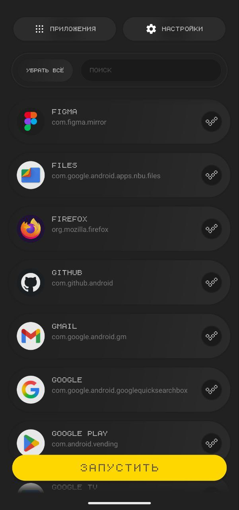
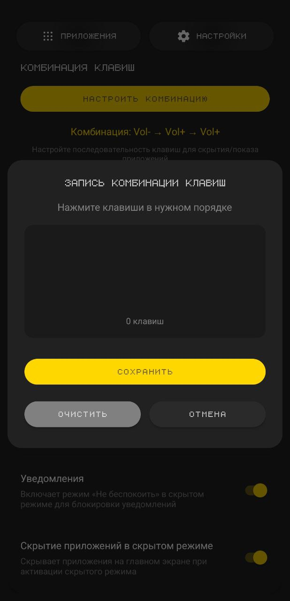
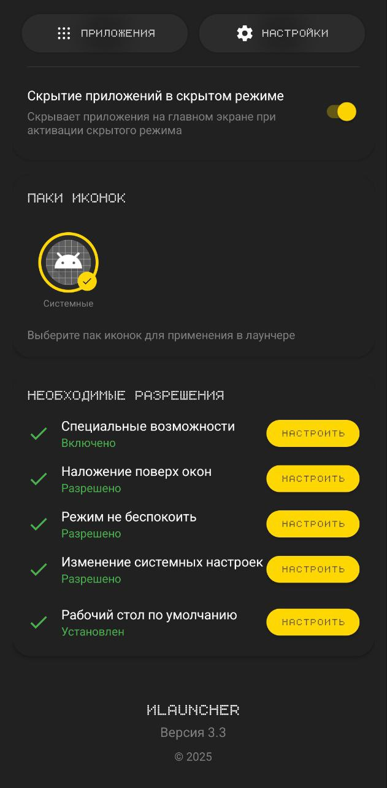

#  ИLauncher v4.0
<br clear="left"/>

## 🚀 Версия 4.0 - Стабильный релиз с критическими исправлениями

**ИLauncher** — это современный Android лаунчер, разработанный для кнопочных телефонов (но работает также и на сенсорных смартфонах) и устройств с физическими клавишами. Главная особенность — **скрытый режим**, который позволяет мгновенно спрятать выбранные приложения и заблокировать устройство по комбинации клавиш.

### ⚠️ ВАЖНО: Рекомендации по установке

> **Если у вас не работает полноценная блокировка экрана или закрытие приложений:**
> 1. Полностью **удалите** ИLauncher
> 2. **Переустановите** приложение заново
> 3. **Выдайте все разрешения** при первом запуске
> 
> Это связано с обновлением системных сервисов в версии 4.0, которые требуют чистой установки для корректной работы.

### 📱 Для пользователей кнопочных телефонов

**По умолчанию лаунчер настроен для сенсорных смартфонов.** Чтобы открыть меню приложений на кнопочном телефоне:

1. **Свайп вверх** по экрану (если есть сенсор)
2. **ИЛИ** перейдите в **Настройки** → **Настройки меню**
3. Выберите **"Способ открытия"** → **"Навигация вниз (D-pad)"**
4. Теперь нажимайте **клавишу вниз** на D-pad для открытия меню

> **Совет:** После настройки способа открытия через D-pad, вы можете навигироваться по приложениям стрелками и запускать их центральной кнопкой.

### 📌 Что такое скрытый режим?

**Скрытый режим** в ИLauncher — это специальное состояние лаунчера, которое активируется комбинацией физических клавиш. При активации:
- Выбранные приложения временно исчезают с главного экрана
- Блокируется сенсорный экран от случайных нажатий
- Закрываются все открытые приложения
- Активируется режим «Не беспокоить»
- Блокируется возможность делать скриншоты*

Это полезно когда нужно быстро скрыть личную информацию, передать телефон другому человеку или просто убрать отвлекающие приложения.

> **Примечание о блокировке скриншотов:** Блокировка работает глобально во всех приложениях благодаря системному оверлею. Из-за ограничений Android, блокировка не работает на экране блокировки. В настройках телефона (раздел "Жесты") можно включить создание скриншотов жестом проведения 3 пальцев по экрану, и отключить создание скриншотов зажатием кнопки громкости и кнопки питания. Поскольку в скрытом режиме экран полностью блокируется от касаний, скриншоты жестами также становятся невозможными. *Функция управления жестами доступна не на всех версиях Android.*

### 🎯 Ключевые особенности

- **🔒 Скрытый режим** — мгновенное скрытие приложений по комбинации клавиш
- **🎹 Физическое управление** — полная поддержка кнопочных телефонов
- **🛡️ Умное управление** — блокировка сенсора и закрытие приложений
- **⚙️ Гибкая настройка** — кастомные комбинации клавиш
- **🎨 Темная тема** — стильный минималистичный дизайн
- **📱 Оптимизация** — работает на слабых устройствах

### 🆕 Что нового в версии 4.0

#### 🐛 Исправлены критические баги

**1. Множественное открытие меню приложений**
- **Проблема:** При быстрых нажатиях D-pad вниз открывалось несколько экземпляров меню одновременно
- **Решение:** Добавлен тройной механизм защиты:
  - Флаг состояния `isAppDrawerOpen` предотвращает повторное открытие
  - Debouncing 500мс блокирует быстрые повторные вызовы
  - Проверка FragmentManager на существующий диалог
  - Callback при закрытии гарантирует корректный сброс флага

**2. Пустые страницы в скрытом режиме**
- **Проблема:** В режиме кнопочных телефонов при активации скрытого режима пользователи оставались на пустых страницах
- **Решение:** Автоматический переход на первую страницу меню при изменении режима
  - Используется `PaginatedGridLayoutManager.navigateToPosition(0)`
  - Сброс фокуса на первый элемент списка
  - Работает как при входе, так и при выходе из скрытого режима

**3. Нежелательное открытие меню**
- **Проблема:** При отключении главного экрана в настройках автоматически открывалось меню приложений
- **Решение:** Убрано автоматическое открытие, пользователь остается в настройках

**4. Восстановление после обновления**
- **Проблема:** После обновления приложения не работали специальные возможности
- **Решение:** 
  - `LauncherApplication` отслеживает версию приложения
  - `SystemBlockAccessibilityService` автоматически переинициализируется
  - `HiddenModeStateManager` восстанавливает свое состояние
  - `BootReceiver` обрабатывает обновление через `ACTION_MY_PACKAGE_REPLACED`

#### ✨ Улучшения интерфейса

**1. Плавная анимация скрытия иконок**
- Настроены длительности анимаций RecyclerView (200-250мс)
- Добавлены callbacks для отслеживания завершения обновления
- Задержка 100мс перед обновлением для плавности переходов
- Использование метода `updateAppsList()` вместо прямой перезагрузки

**2. Улучшенный диалог настройки сетки**
- Добавлен межстрочный интервал (lineSpacing 10dp) для заголовка
- Кнопки +/- используют шрифт 5mal6Lampen для единообразия
- Увеличен размер текста в кнопках в 2 раза (44sp)
- Улучшено центрирование символов в круглых кнопках

#### 🔧 Технические улучшения

- **Совместимость:** Все настройки пользователей сохраняются при обновлении
- **Производительность:** Оптимизирована работа со слабыми устройствами
- **Стабильность:** Устранены проблемы с race conditions при загрузке приложений
- **D-pad навигация:** Полная поддержка физической клавиатуры и кнопочных телефонов

## 📸 Скриншоты

<table>
  <tr>
    <td></td>
    <td></td>
    <td></td>
    <td></td>
  </tr>
  <tr>
    <td align="center">Список приложений</td>
    <td align="center">Настройки</td>
    <td align="center">Запись клавиш</td>
    <td align="center">Разрешения</td>
  </tr>
</table>

## ⚡ Функциональные возможности

### 🔐 Возможности скрытого режима
Активируйте скрытый режим комбинацией клавиш для быстрого управления видимостью приложений:
- **Скрытие приложений** — выбранные приложения исчезают с главного экрана
- **Блокировка сенсора** — предотвращает случайные нажатия
- **Закрытие окон** — автоматически закрывает все запущенные приложения
- **Режим «Не беспокоить»** — блокирует уведомления
- **Блокировка скриншотов** — глобально запрещает снимки экрана во всех приложениях (кроме экрана блокировки)*

### 🎮 Управление физическими клавишами
- **Стандартные комбинации** — Vol+ → Vol+ → Vol+ или Vol+ → Vol- → Vol+
- **Кастомные комбинации** — запишите любую последовательность клавиш
- **Поддержка клавиш** — цифры 0-9, *, #, громкость, навигация
- **Умное распознавание** — работает даже при быстром наборе

### 🎨 Персонализация
- **Сетка приложений** — выбор между 3, 4 или 5 колонками
- **Паки иконок** — поддержка сторонних наборов иконок
- **Скрытие приложений** — выберите какие приложения показывать
- **Темная тема** — элегантный дизайн с желтыми акцентами

### ⚙️ Интеллектуальные функции
- **Автоматическая прокрутка** — к важным разделам настроек
- **Умный поиск** — быстрый поиск по приложениям
- **Контекстное меню** — долгое нажатие для дополнительных опций
- **Оптимизация памяти** — эффективная работа на слабых устройствах

## 📋 Системные требования

- **Android:** 11.0 (API 30) и выше
- **Поддержка устройств:** Телефоны с физическими кнопками и сенсорные смартфоны
- **Память:** 50+ МБ свободного места
- **Разрешения:** Специальные возможности, наложение поверх окон

## 🚀 Установка

Подробная инструкция по установкм, если у вас есть системные ограничения (с помощью Shizuku и ADB-команды): [SHIZUKU_WIFI.md](SHIZUKU_WIFI.md)

### Быстрая установка

1. **Скачайте APK:** `ИLauncher.apk` из раздела Releases
2. **Разрешите установку** из неизвестных источников в настройках Android
3. **Установите APK** и следуйте инструкциям

### Сборка из исходников

```bash
# Клонирование репозитория
git clone https://github.com/yourusername/ilauncher.git
cd ilauncher

# Сборка debug версии
./gradlew assembleDebug

# Установка на устройство
adb install app/build/outputs/apk/debug/ИLauncher.apk
```
## ⚠️ Известные особенности

### Совместимость

- **Nova Launcher:** Может конфликтовать с ИLauncher. Рекомендуется удалить Nova Launcher для стабильной работы
- **MIUI/ColorOS/OneUI:** Требуется дополнительная настройка разрешений в настройках безопасности
- **Android 12+:** Необходимо явно разрешить специальные возможности

### Ограничения системы

- **Системные клавиши:** Кнопка питания не может быть перехвачена
- **Блокировка скриншотов:** Не работает на экране блокировки
- **Виджеты:** Пока не поддерживаются

## 📊 Производительность

### Оптимизации для слабых устройств

- **Кеширование иконок:** 2-секундный кеш для снижения нагрузки
- **Debouncing:** Задержка 100-150мс для предотвращения лишних операций
- **Умная загрузка:** Загрузка только видимых элементов
- **Память:** Оптимизировано для работы с 50МБ RAM

### Протестировано на реальных устройствах

| Устройство | Android | Процессор | RAM | Результат |
|------------|---------|-----------|-----|----------|
| **Realme C21-Y** | Android 11 | MediaTek Helio G35 | 3/4 GB | ✅ Отлично, без лагов |
| **Nothing Phone (2)** | Android 14 | Snapdragon 8+ Gen 1 | 8/12 GB | ✅ Отлично, без лагов |

**Статус совместимости:**
- ✅ **Android 11 и выше** — полная поддержка
- ✅ **Кнопочные телефоны** — оптимизировано
- ✅ **Бюджетные устройства** — работает без лагов
- ✅ **Флагманские смартфоны** — максимальная производительность

> **Примечание:** ИLauncher успешно протестирован на устройствах от бюджетных до флагманских. Работает стабильно без лагов и вылетов на всех протестированных устройствах.

## 🎯 Начало работы

### 1️⃣ Первый запуск

После установки ИLauncher:

1. **Нажмите кнопку Home** на вашем устройстве
2. **Выберите ИLauncher** из списка лаунчеров
3. **Нажмите «Всегда»** для установки по умолчанию

### 2️⃣ Настройка разрешений

Приложение автоматически покажет недостающие разрешения:

- **🔧 Специальные возможности** — для перехвата клавиш и управления
- **🖼️ Наложение поверх окон** — для блокировки сенсора
- **🔕 Режим «Не беспокоить»** — для управления уведомлениями
- **📝 Изменение системных настроек** — для системных функций
- **🏠 Рабочий стол по умолчанию** — для полной замены лаунчера

### 3️⃣ Настройка скрытого режима

1. **Откройте Настройки** (свайп вправо или кнопка ⚙️)
2. **Выберите комбинацию клавиш:**
   - Используйте готовую: Vol+ → Vol+ → Vol+
   - Или создайте свою: нажмите «ЗАПИСАТЬ КОМБИНАЦИЮ»
3. **Настройте что будет происходить в скрытом режиме:**
   - ✅ **Скрытие приложений** — выбранные приложения временно исчезнут
   - ✅ **Блокировка сенсора** — экран не будет реагировать на касания
   - ✅ **Закрытие окон** — все открытые приложения закроются
   - ✅ **Режим «Не беспокоить»** — отключатся уведомления
   - ✅ **Блокировка скриншотов** — невозможно будет сделать снимок экрана*

### 4️⃣ Выбор приложений для скрытия

1. **Перейдите в «Приложения»** 
2. **Нажмите «УБРАТЬ ВСЁ»** для начала
3. **Выберите приложения** которые должны быть видны
4. **Нажмите «ЗАПУСТИТЬ»** для сохранения

## 💡 Советы по использованию

### Для кнопочных телефонов
- Используйте **цифровые клавиши** для быстрого доступа
- Настройте комбинацию из **часто используемых кнопок**
- Включите **блокировку сенсора** если есть сенсорный экран

### Для полного контроля
- Включите **все функции** скрытого режима
- Используйте **сложную комбинацию** клавиш
- Выберите какие **приложения скрывать** из списка
- Отключите **жесты для скриншотов** в настройках телефона (раздел "Жесты")

### Для слабых устройств
- Выберите **3 колонки** для больших иконок
- Отключите **неиспользуемые функции**
- Используйте **системные иконки** вместо паков

## Основные компоненты

### MainActivity
- Главный экран лаунчера
- Отображение приложений в виде сетки
- Обработка нажатий физических клавиш
- Управление блокировкой экрана

## 🏗️ Архитектура

### Основные компоненты

**MainActivity** — Главный экран лаунчера
- Сетка приложений с адаптивным размером
- Обработка физических клавиш и комбинаций
- Управление скрытым режимом
- Контекстное меню для приложений

**AppListActivity** — Управление приложениями
- Полный список установленных приложений
- Множественный выбор для скрытия/показа
- Интеллектуальный поиск
- Сохранение настроек видимости

**SettingsActivity** — Настройки лаунчера
- Запись кастомных комбинаций клавиш
- Управление функциями скрытого режима
- Выбор паков иконок
- Настройка сетки приложений
- Управление разрешениями

### Сервисы и менеджеры

**HiddenModeStateManager** — Управление скрытым режимом
- Централизованное управление состоянием
- Координация всех функций скрытого режима
- Синхронизация с настройками

**TouchBlockService** — Блокировка сенсора
- Создание прозрачного оверлея
- Перехват всех касаний экрана
- Автоматическое управление жизненным циклом

**SystemBlockAccessibilityService** — Специальные возможности
- Перехват физических клавиш
- Закрытие всех приложений
- Системные операции

**IconPackManager** — Управление иконками
- Загрузка сторонних паков иконок
- Кеширование для производительности
- Поддержка множества форматов

## 🔐 Разрешения

### Обязательные разрешения

| Разрешение | Назначение |
|------------|------------|
| `QUERY_ALL_PACKAGES` | Получение списка установленных приложений |
| `SYSTEM_ALERT_WINDOW` | Блокировка сенсора через оверлей |
| `BIND_ACCESSIBILITY_SERVICE` | Перехват физических клавиш |
| `ACCESS_NOTIFICATION_POLICY` | Управление режимом «Не беспокоить» |
| `WRITE_SETTINGS` | Изменение системных настроек |

### Дополнительные разрешения

| Разрешение | Назначение |
|------------|------------|
| `EXPAND_STATUS_BAR` | Управление панелью уведомлений |
| `RECEIVE_BOOT_COMPLETED` | Автозапуск после перезагрузки |
| `REQUEST_DELETE_PACKAGES` | Удаление приложений |

## 🛠️ Технологии

### Стек разработки

- **Язык:** Kotlin 1.9.0
- **Минимальный SDK:** API 30 (Android 11.0)
- **Целевой SDK:** API 34 (Android 14)
- **Gradle:** 8.0

### Библиотеки и фреймворки

- **UI компоненты:**
  - Material Design Components 1.11.0
  - ViewBinding для связывания представлений
  - ConstraintLayout для адаптивных макетов
  - RecyclerView для списков

- **Архитектура:**
  - MVVM паттерн с ViewModel
  - LiveData для реактивных данных
  - Room Database для персистентности
  - Repository паттерн для данных

- **Асинхронность:**
  - Kotlin Coroutines
  - Flow для потоков данных
  - Lifecycle-aware компоненты

- **Оптимизация:**
  - Glide для загрузки иконок
  - Кеширование в памяти
  - Debouncing для операций

## 🔧 Решение проблем

### Приложение не устанавливается как лаунчер по умолчанию

**Решение:**
1. Перейдите в Настройки → Приложения → Приложения по умолчанию
2. Выберите "Главный экран" или "Launcher"
3. Выберите ИLauncher из списка
4. Если не помогло - перезагрузите устройство

### Не работают физические клавиши

**Решение:**
1. Проверьте разрешение "Специальные возможности"
2. Убедитесь, что служба SystemBlockAccessibility включена
3. Попробуйте перезапустить приложение
4. Используйте клавиши громкости вместо других кнопок

### Блокировка сенсора не активируется

**Решение:**
1. Проверьте разрешение "Наложение поверх окон"
2. На MIUI/ColorOS: Настройки → Конфиденциальность → Специальный доступ
3. Разрешите "Показ поверх других приложений"
4. Перезапустите ИLauncher

### Приложения исчезают после удаления

**Решение:**
1. Это нормальное поведение - список обновляется автоматически
2. Если приложения не появляются после установки - перезапустите лаунчер
3. Проверьте настройки видимости в разделе "Приложения"

### Скрытый режим включается сам

**Решение:**
1. Проверьте настройку "Скрытие приложений в скрытом режиме"
2. Если выключена - включите и выключите снова
3. Очистите данные приложения и настройте заново

## 🤝 Вклад в проект

### Как помочь проекту

1. **Сообщайте о багах** через Issues
2. **Предлагайте функции** в Discussions
3. **Переводите** на другие языки
4. **Тестируйте** на разных устройствах
5. **Делитесь** с друзьями

### Разработка

```bash
# Форк репозитория
git fork https://github.com/yourusername/ilauncher

# Создайте ветку для функции
git checkout -b feature/amazing-feature

# Закоммитьте изменения
git commit -m 'Add amazing feature'

# Отправьте в ветку
git push origin feature/amazing-feature

# Откройте Pull Request
```

## 📜 Лицензия

Этот проект лицензирован под MIT License - см. файл [LICENSE](LICENSE) для деталей.

## 🌟 Благодарности

- Сообществу Android разработчиков
- Контрибьюторам проекта
- Пользователям за обратную связь
- Разработчикам библиотек с открытым кодом

## 📞 Контакты

- **GitHub Issues:** [Сообщить о проблеме](https://github.com/yourusername/ilauncher/issues)
- **Discussions:** [Обсуждения](https://github.com/yourusername/ilauncher/discussions)
- **Email:** ilauncher@example.com

---

<p align="center">
  Сделано с ❤️ для сообщества Android
  <br>
  <strong>ИLauncher v4.0</strong> • © 2025
</p>
